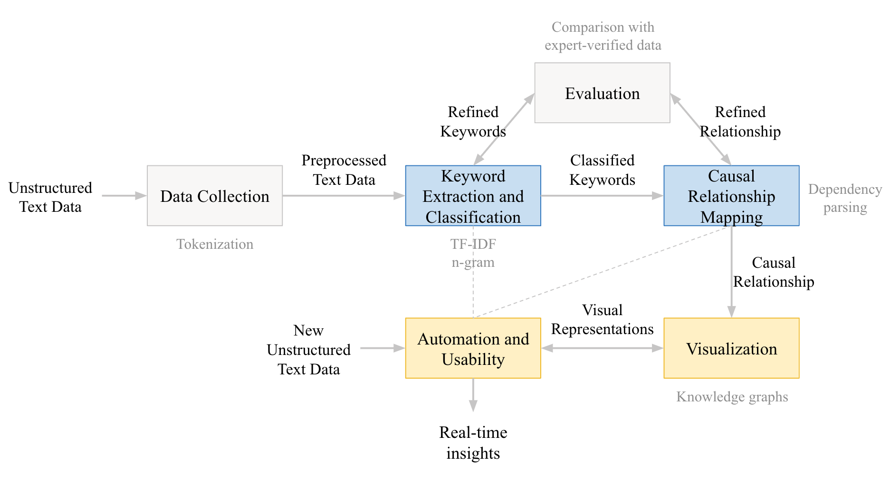

<!-- 
README.md for the project: Inferring Causes of Reactor Overheat Issues Using NLP
GitHub Repository: https://github.com/separk-1/Inferring-Cause-of-Reactor-Overheat-Issues-Using-NLP 
-->

# 🚀 Inferring Cause of Reactor Overheat Issues Using NLP

This project was conducted as part of the **12-746 Fall 2024 Mini 1 class** at **Carnegie Mellon University**.

## 🌟 Overview

In nuclear power plants, managing reactor overheating is essential for maintaining **safety**, **reliability**, and **operational efficiency**. Cooling system failures can result in **decay heat accumulation**, leading to catastrophic incidents like core meltdowns or hydrogen explosions, potentially releasing harmful radioactive materials.

This project applies **Natural Language Processing (NLP)** techniques to analyze reactor safety documents and extract important insights related to the **causes**, **effects**, and **countermeasures** for **Loss of Coolant Accidents (LOCA)**.

### 🎯 Project Objectives

- Automatically extract keywords related to LOCA and reactor overheating from unstructured text data.
- Map and visualize **causal relationships** between extracted keywords (e.g., coolant failure and temperature rise).
- Provide real-time, actionable insights through a visually interactive framework.

---

## 🛠️ System Architecture



The above diagram illustrates the **end-to-end process** of this framework, from **data collection** to **visualization**. It also showcases how **automation** drives real-time updates and continuous insights.

### 🔑 Key Components

1. **Data Collection & Preprocessing**:
   - Collect unstructured text data from safety regulatory documents such as **NUREG-0800**.
   - Preprocess data using tokenization, stop-word removal, and stemming.

2. **Keyword Extraction & Classification**:
   - Implement **TF-IDF** and **n-grams** for keyword extraction.
   - Classify keywords into **cause**, **effect**, and **countermeasure** categories.

3. **Causal Relationship Mapping**:
   - Use **dependency parsing** to identify cause-effect relationships.
   - Generate a directed graph to visualize these relationships.

4. **Visualization**:
   - Employ **matplotlib** and **networkx** to create knowledge graphs.
   - Represent the relationships between causes, effects, and countermeasures in an intuitive, visual format.

5. **Automation & Usability**:
   - Design an automated system that continuously updates with new data, providing **real-time insights** for decision-making.

## 📋 Configuration File

The **config.yml** file contains all the configurations for the project, including the file paths and keywords used in the NLP process. This allows for easy updates without modifying the core code.

### Sample config.yml:
```yaml
paths:
  data_folder: '../data'
  output_file: '../results/temperature_sentences.txt'

keywords:
  temperature_related: 
    - "temperature"
    - "heat"
    - "cooling"
    - "thermal"
    - "overheat"
    - "overheating"
    - "coolant"
    - "hot"
```

## ⚡ How to Run

<!-- Step-by-step guide for running the project locally -->

1. **Clone the repository**:
   <!-- Clone the project from the GitHub repository using the following command -->
   ```bash
   git clone https://github.com/separk-1/Inferring-Cause-of-Reactor-Overheat-Issues-Using-NLP.git
   cd Inferring-Cause-of-Reactor-Overheat-Issues-Using-NLP
   ```

2. **Install the required packages**:
   ```bash
   conda env create -f environment.yml
   python -m spacy download en_core_web_sm
   ```

3. **Run the main script**:
    <!-- Execute the main script to process the text data and visualize the results -->
    ```bash
    python run.py
    ```

4. **Run the Sentence Extraction Script**:
   ```bash
   python run/extract_sentences.py
    ```
This script reads PDF files from the folder specified in config.yml and extracts sentences related to temperature or any other keywords listed in the configuration file.
The output will be saved in the file specified in the output_file path in config.yml.

## 📚 Data Sources

The primary data used in this project is sourced from [**NUREG-0800**](https://www.nrc.gov/reading-rm/doc-collections/nuregs/staff/sr0800/ch5/index.html). Relevant sections include:

- **5.2.3** Reactor Coolant Pressure
- **5.2.4** Reactor Coolant Pressure Boundary Inservice
- **5.2.5** Reactor Coolant Pressure Boundary Leakage Detection
- **5.3.2** Pressure-Temperature Limits, Upper-Shelf Energy, and Pressurized Thermal Shock
- **5.4** Reactor Coolant System Component and Subsystem Design
- **5.4.6** Reactor Core Isolation Cooling System (BWR)
- **5.4.12** Reactor Coolant System High Point Vents

These sections provide critical regulatory guidelines for managing reactor coolant systems and ensuring safety.

---

## 🎯 Learning Goals

The project aims to enhance the following skills:

1. **Keyword Extraction**: Mastering NLP techniques to extract critical terms from unstructured text data using **TF-IDF** and **n-grams**.
2. **Causal Inference**: Learning to infer cause-effect relationships using **dependency parsing** techniques.
3. **Visualization**: Developing proficiency in representing complex data visually using libraries like **matplotlib** and **networkx**.

---

## 🗂️ Project Deliverables

At the conclusion of the project, the following will be delivered:

1. A **causal relationship ontology** related to LOCA.
2. An **interactive dashboard** that visualizes the extracted keywords and causal relationships.
3. A **real-time system** that can continuously process and update unstructured text data from real-world sources.

---

## 📝 Timeline

- **Data Collection** – ✅ Completed
- **Keyword Extraction & Causal Mapping** – 🚧 In Progress (target date: 09/26)
- **Visualization & Evaluation** – 🔄 Upcoming (target date: 10/03)
- **Automation & Reproducibility** – 🔄 Upcoming (target date: 10/10)